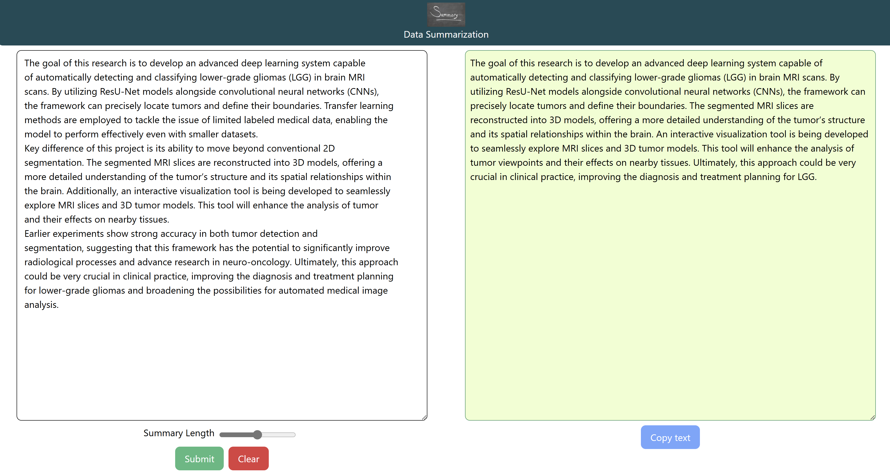

# AI Text Summarization Web Application
This is a web-based application that provides users with an easy-to-use interface to summarize long pieces of text. The app handles user requests, processes the text using natural language processing techniques, and delivers a concise summary.

## Screenshots

Here is a screenshot of the AI Text Summarization Web Application:

## Features
Text Summarization: Automatically generate a concise summary of any given text.

Natural Language Processing (NLP): Leverages NLTK for tokenization, stemming, and stop-word removal to enhance summarization accuracy.

Responsive Web Interface: Designed with Tailwind CSS for a clean and responsive user interface.

Flask Framework: Lightweight backend built with Flask to handle text processing and API integration.
## Tech Stack
Backend: Python (Flask)

Frontend: HTML, Tailwind CSS

Natural Language Processing (NLP): NLTK (Natural Language Toolkit)

## Usage
Enter the text you want to summarize in the input box on the homepage.

Click the "Summarize" button.

The summarized text will be displayed on the screen.
